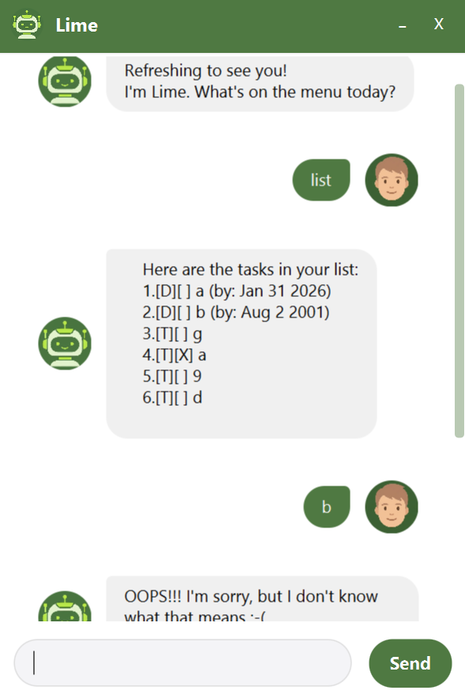

### 🤖Lime🍋 - Your Zesty Task Assistant
> _"Lime is the best!"_ -- Myself

Refreshing to see you! Lime is a desktop chatbot that helps you squeeze more productivity out of your day by recording and tracking your tasks.

---

## 🎨 UI Preview


---

### Here are what 🤖Lime🍋 stands out

- Easy commands
- Clear user interface
- No monetary cost

---

### 🚀 Deployment

1. Download from [here](https://github.com/Bai-Zihan/ip)
2.  Run the code
3. Give your work to **Lime!**

---

### ✔ Features
- [x] Add tasks
- [ ] Delete tasks
- [ ] Find tasks
- [ ] Mark tasks
- [ ] Sort tasks

---

### 📖 Command Guide

### 1. Add Tasks with a Zest
* **Todo**: `todo [description]` - Adds a task to the pulp.
* **Deadline**: `deadline [description] /by [YYYY-MM-DD]` - Sets a expiration date for your juice.
* **Event**: `event [description] /from [time] /to [time]` - Schedules a fresh event.

### 2. View the Pulp
* **List**: `list` - Shows all tasks currently in your bucket.
* **Sort**: `sort` - Sort all tasks by their ending dates.

### 3. View the Tasks
* **Find**: `find [keyword]` - Find a task contains a specific keyword.
*  **On**: `on [index]` - Find a task to be done at a specific time

### 4. Squeeze Out Tasks
* **Mark**: `mark [index]` - Marks a task as deliciously done.
* **UnMark**: `unmark [index]` -Marks a task as undone.
* **Delete**: `delete [index]` - Removes a task from the pulp-free list.

---

### 💻 Code Example
Here is a snippet of the `main` method:
```java
public static void main(String[] args) {
    new Lime("data/tasks.txt").run();
}